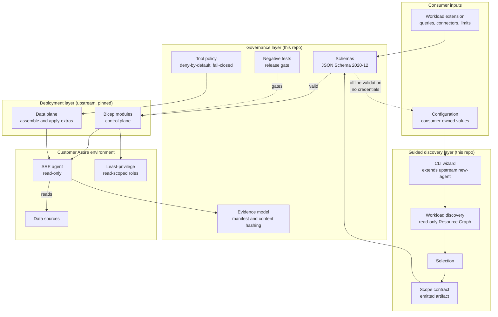
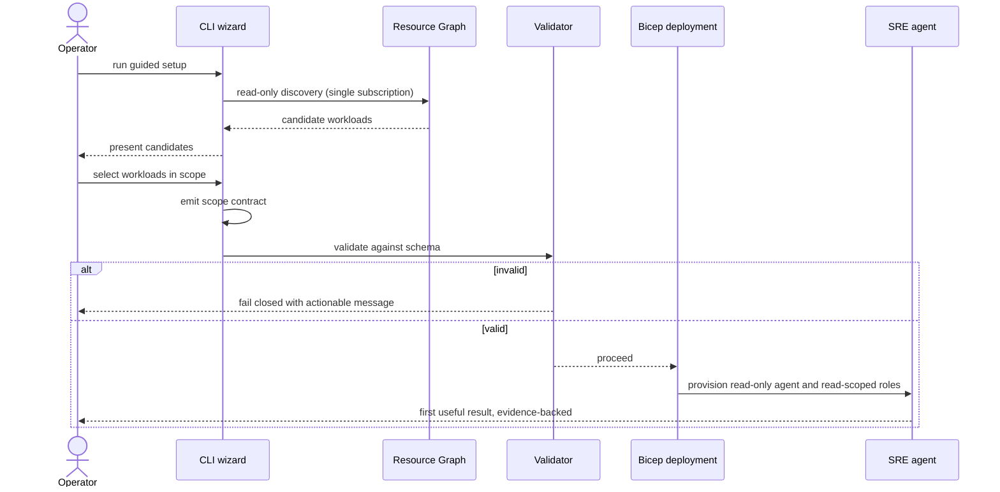

# Architecture Overview

**Status**: Draft
**Date**: 2026-09-23
**Binds to**: [ADR-0001](decisions/0001-upstream-template-relationship.md),
[ADR-0002](decisions/0002-infrastructure-as-code.md),
[ADR-0003](decisions/0003-guided-deployment-experience.md),
[Minimum SRE Agent Contract](minimum-sre-agent-contract.md)

## Purpose

This document describes how the framework is structured and why, and proposes the
repository layout that follows from the accepted decisions. It is the last Slice 2 artifact
before planning.

Two constraints shape everything below:

- **CON-11 — quick wins for any customer.** The core carries no customer-specific content,
  and a first useful read-only result must be reachable in one working session without
  writing code.
- **CON-05 — zero core edits to onboard a workload.** Onboarding is configuration, never
  modification.

Both are structural claims, not aspirations. The architecture must make violating them
visible in a diff, which is why the core-extension seam below is a directory boundary and
not a convention.

## Layering

ADR-0001 establishes three layers. Their boundaries are deliberate: each layer has a
different owner, a different change rate and a different failure consequence.

| Layer | Owner | Change rate | Contents |
|-------|-------|-------------|----------|
| **Deployment layer** | Upstream `microsoft/sre-agent`, pinned | Changes on upgrade only, never edited here | Bicep modules, lifecycle scripts, data-plane assembly and extras application |
| **Governance layer** | This repository | Changes with the contract | Schemas, tool policy, evidence model, negative tests, security posture |
| **Guided discovery layer** | This repository | Changes with the wizard | Workload discovery, selection, scope contract emission and validation |
| **Workload extensions** | The consumer | Changes per customer | Queries, alert definitions, connectors, limits, report shaping |

The critical property: **the governance layer sits above the deployment layer, not inside
it.** Upstream is composed and parameterized, never forked. That is what keeps the upgrade
procedure in ADR-0001 tractable — an upstream bump changes a pinned reference and runs a
compatibility test, rather than requiring a merge.

## Component View



Two edges in that diagram carry most of the design intent.

**`SCHEMA -.-> CFG`, offline validation with no credentials.** This is SC-07. A consumer can
author and fully validate a configuration before touching their subscription. It is also
what makes the quick win safe to attempt — nobody has to deploy to find out whether their
input was well-formed.

**`NEG -.-> BICEP`, negative tests gating deployment.** The read-only guarantee is an
assertion until write denial, self-approval denial, change-set execution denial and
untrusted-content handling are proven. Placing the gate before deployment rather than after
is what converts the safety argument into evidence (SC-06).

## Adoption Flow



The `alt invalid` branch is not incidental. CON-11 cannot tolerate an unexplained failure in
the first session, so every failure path must name the failing step, the probable cause and
the recovery action (FR-38), and must fail closed rather than proceed on partial input.

## How the Constraints Are Structurally Enforced

| Constraint | Structural mechanism | Detected by |
|------------|---------------------|-------------|
| CON-02 — read-only guarantee | **RBAC is ground truth**: Azure Resource Manager denies a write regardless of the agent's configured tool set. The tool policy is defence-in-depth above it, not the primary control (SEC-001) | Post-deployment assertion that the agent principal holds no non-read role anywhere in the subscription (SEC-003) |
| CON-05 — zero core edits to onboard | Core and extensions are separate directory trees; onboarding writes only to consumer-owned paths | Automated diff against declared core paths (SC-01) |
| CON-11 — no customer-specific content in the core | Same boundary, inverted: the core has no path where customer values are legal | Sanitization gate extended to customer vocabulary (SC-13) |
| CON-02 — read-only in v1 | Remediation and approval exist as schema and as denial tests, with no execution path | Negative tests as a release gate (SC-06) |
| CON-03 — runtime-agnostic core | `agent.json` appears only in the binding layer; the contract references it through that layer | Inspection; binding-layer path isolation |
| CON-12 — no Terraform work owned here | No Terraform files exist in this repository | File-existence check |
| SC-07 — credential-free validation | Validation depends on schemas only, never on a provider or a subscription | Validation executed in a credential-free environment |

Every row is checkable. That is the point: a constraint that can only be verified by reading
carefully will eventually be violated silently.

## Proposed Repository Structure

The envisioning constraint forbids empty folders and purposeless placeholders, so this
proposal lists only directories that have identified contents. Directories are created when
their first real artifact exists.

```text
.
├── docs/                         # authored artifacts (exists)
│   ├── architecture/             # overview, source analysis, decisions
│   ├── envisioning/              # vision
│   └── features/                 # specifications
├── contracts/                    # governance layer: the contract itself
│   ├── schemas/                  # JSON Schema 2020-12, single source of truth
│   └── vocabulary/               # English enum values with recorded provenance
├── core/                         # the declared core; onboarding never edits this
│   ├── policy/                   # tool policy: deny-by-default, fail-closed
│   ├── evidence/                 # evidence manifest model
│   └── binding/                  # Azure SRE Agent binding; the only place agent.json appears
├── wizard/                       # guided discovery layer
│   ├── discovery/                # read-only Resource Graph queries
│   └── emit/                     # scope contract emission
├── deploy/                       # composition over pinned upstream modules
│   └── upstream.lock             # pinned upstream version, per ADR-0001
├── examples/
│   └── minimal/                  # workload-neutral, proves the core is not workload-coupled
├── extensions/                   # consumer-supplied workload extensions
│   └── README.md                 # the extension contract; ships no customer content
└── tests/
    ├── negative/                 # safety boundary proofs; release gate
    └── validation/               # offline schema validation, credential-free
```

Rationale for the choices that are not obvious:

- **`contracts/` is separate from `core/`.** The contract is what consumers depend on; the
  core is how this framework implements it. Separating them means the contract can be
  versioned and reviewed without implementation churn, and it makes CON-03 legible — a
  runtime-agnostic contract that lived inside the implementation would not stay
  runtime-agnostic for long.
- **`core/binding/` is the only place `agent.json` may appear.** ADR-0001 makes it the
  concrete binding; isolating it to one path turns CON-03 from a promise into a check.
- **`extensions/` ships a README and no content.** This is the seam CON-11 depends on. The
  directory exists to document the extension contract, and shipping any customer content
  here would itself be the violation.
- **`deploy/upstream.lock`** records the **immutable upstream commit digest** plus a digest
  of the fetched tree, making the pin explicit and diffable so an upgrade is a visible,
  security-reviewed change rather than a drift. Per the ADR-0001 amendment, a tag-only or
  version-only pin is rejected, because a tag is mutable and is not an integrity control.
- **No `terraform/` directory**, per CON-12 and the ADR-0002 acceptance note.
- **`tests/negative/` is named for what it proves**, not for the code it exercises, because
  its contents are the evidence behind the read-only claim.

## Open Items Carried Into Planning

| Item | Affects | Note |
|------|---------|------|
| Tool-policy enforcement model | `core/policy/` | Runtime capability identifiers are explicitly unconfirmed in the reference source and must be reconciled against the real runtime |
| English renaming of the reference vocabulary | `contracts/vocabulary/` | Provenance of original values must be preserved |
| Evidence retention and immutability policy | `core/evidence/` | Retention duration and storage location depend on the binding and on customer policy |
| Single source of truth for schemas | `contracts/schemas/` | The reference implementation duplicates schemas across two directories, creating drift; this structure deliberately allows only one location |

## References

- `prd.md`
- [Minimum SRE Agent Contract](minimum-sre-agent-contract.md)
- [Framework Configuration Reference](framework-configuration-reference.md)
- [Source analysis and pattern inventory](source-analysis.md)
- `docs/features/sre-agent-recipe-framework/spec.md`
- `docs/envisioning/README.md`
