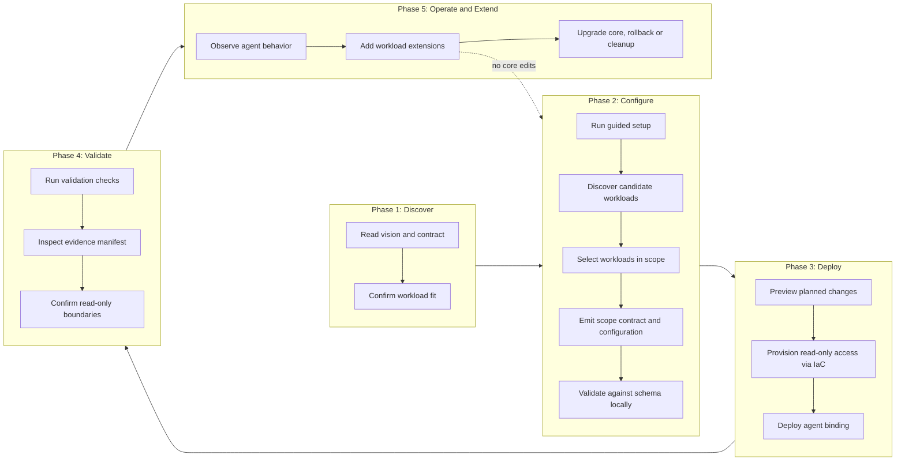

# Envisioning: Zero Ops SRE Agent Recipe

> **Status:** In Validation
>
> **Last updated:** 2026-09-23
>
> **Version:** 1.0

---

## 1. Client Context

### 1.1 Direct Client

The team or organization we are serving directly (our client).

| Aspect | Information |
|--------|-------------|
| **Company/Team** | Microsoft field practice (CSA/field engineering) that reuses the recipe across customer engagements. Evidence: `LICENSE` carries `Copyright (c) Microsoft Corporation`, `SECURITY.md` routes reports to MSRC at <https://aka.ms/SECURITY.md>, and `CONTRIBUTING.md` requires the Microsoft CLA. |
| **Domain** | Cloud reliability engineering and AI-assisted operations (Zero Ops) on Azure. |
| **Team scale** | Small maintaining core (fewer than 10 engineers owning the reusable core), with a larger distributed population of consuming engagements. |
| **Channels** | Git repository, Infrastructure as Code, CLI and CI/CD pipelines, agent runtime configuration. Not a hosted product or end-user UI. |

The direct client owns and maintains the reusable core. Engagement teams consume it and extend it without editing the core.

### 1.2 End Client

The user or consumer served by the direct client.

| Aspect | Information |
|--------|-------------|
| **Profile** | Primary: platform and SRE engineers at customer organizations who will run the agent against their own workloads. Strong secondary: consultants and CSAs deploying on the customer's behalf during an engagement. |
| **Volume** | `[TO BE MEASURED]` No adoption baseline exists. Instrument the first two real adoptions before stating any number. |
| **Usage context** | Repository cloned or referenced into a customer environment, configured for one workload, deployed via IaC to an Azure subscription, then operated and validated by the customer team. |

Application and product teams self-serving without an SRE intermediary are explicitly out of scope for the first version (see Non-goals).

### 1.3 Additional Context

- The authoritative product input is `prd.md` in this repository.
- A single-customer implementation exists as a read-only reference (`ZeroOps-Cortex`, Portuguese-language, containing real customer environment data). It proves the operating model works but is coupled to one customer.
- A Portuguese-language SRE agent guide (`GUIA-SRE-AGENT-PTBR.html`) provides structural guidance for agent artifacts.
- This repository is a generalization of the proven patterns, not a clone or rename of the reference implementation.

---

## 2. Project Focus

### Prioritized Problem

Implementing Zero Ops capabilities for a new workload currently restarts from a single-customer implementation. Each new engagement re-derives the agent contract, the evidence model, the configuration shape, and the deployment path by reading and adapting customer-coupled code. This costs time, produces inconsistent results, and makes quality dependent on the individual engineer.

| Aspect | Decision |
|--------|----------|
| **Chosen focus** | A reusable, version-controlled recipe that defines the minimum SRE agent contract, a machine-validatable configuration model, an evidence model, and a repeatable deployment and validation path. |
| **Justification** | `prd.md` states the business goal as reducing time, ambiguity, and duplicated effort for new workloads. The reference implementation already contains generalizable assets (state vocabulary, evidence classification, seven JSON schemas, scope-contract hashing, negative tests as a release gate); the missing piece is generalization, not invention. |
| **Initial scope** | Reusable core contract and schemas; read-only diagnostic capability; evidence and traceability model; a guided pre-deployment step that discovers and selects the target workloads and emits a version-controlled scope contract; IaC foundation and repeatable deployment; local validation; a workload-neutral `examples/minimal/` and an AKS `examples/reference-workload/`; security and sanitization discipline. |
| **Out of initial scope** | See Non-goals below. |

### 2.1 Non-goals (first version)

| Non-goal | Reason |
|----------|--------|
| Executing mutating remediation | The core stays read-only. Remediation is defined as a contract and an extension point only, and is clearly marked as not implemented. |
| Self-service adoption by application teams without an SRE intermediary | The guided experience is optimized for platform and SRE engineers. Broader self-service is a later consideration. |
| Multi-runtime agent bindings | Azure SRE Agent is the first and only concrete binding. The core contract stays runtime-agnostic so additional bindings remain possible. |
| Selecting the IaC technology | Decided in a dedicated ADR with a weighted matrix, not in envisioning. |
| Multi-cloud or non-Azure targets | The reference evidence and the deployment model are Azure-specific. |
| Reproducing customer-specific content | reference-customer naming, the `CTX-01..CTX-13` procedure numbering, and real-environment evidence under `docs/assessments/` are excluded by construction. |

---

## 3. Target Users

### 3.1 Platform / SRE Engineer at a Customer Organization (primary)

Owns reliability for one or more production workloads. Has subscription-scoped access, understands the workload, and is accountable for what an agent is allowed to do in their environment.

**Key needs:**

- Understand the minimum agent contract without reading another customer's source code.
- Discover which workloads in the subscription are eligible, and select the ones in scope, before anything is provisioned.
- Onboard a new workload by editing configuration only, never the reusable core.
- Know exactly which permissions are granted and that the agent cannot mutate the environment.
- Obtain a defensible chain of evidence for every agent conclusion, including what could not be observed.
- Validate a deployment locally before touching a live subscription, and roll it back cleanly.

### 3.2 Consultant / CSA Delivering on the Customer's Behalf (secondary)

Deploys the recipe inside a time-boxed engagement, often in an unfamiliar environment, and must hand the result over to the customer team.

**Key needs:**

- A short, deterministic path from clone to a validated deployment.
- Placeholders instead of environment-specific values, so nothing customer-identifying leaks between engagements.
- Extension points for engagement-specific scenarios that survive an upgrade of the core.
- Documentation that doubles as the handover artifact.

---

## 4. Diagnosis: Known Pain Points

### 4.1 Business Pain Points

| Problem | Impact | Source |
|---------|--------|--------|
| Every new workload restarts from a single-customer implementation | Duplicated effort and ambiguity per engagement; delivery time depends on the individual engineer rather than on a repeatable asset | `prd.md`, "The primary business goal is to reduce the time, ambiguity, and duplicated effort required to implement Zero Ops capabilities for new workloads" |
| No baseline exists for time from zero to a validated deployment | The improvement cannot be claimed or defended today | `[TO BE MEASURED]` Capture by instrumenting the first two real adoptions |
| Inconsistent results across engagements | Quality and safety posture vary by delivery; no shared definition of "done" for an SRE agent | Reference implementation is customer-coupled (reference-customer naming, `CTX-01..CTX-13` procedure numbering) and cannot be handed to another customer as-is |
| Knowledge is locked in a Portuguese-language, customer-specific codebase | Limits reuse to people with access to that codebase and that language | `ZeroOps-Cortex` is read-only by construction and contains real customer environment data; `GUIA-SRE-AGENT-PTBR.html` is also Portuguese |

**Main impact area:**

- [ ] End user experience
- [ ] Internal operations
- [x] Costs/efficiency
- [x] Growth/scalability
- [ ] Multiple areas

### 4.2 Technical Pain Points

| Category | Problem | Impact |
|----------|---------|--------|
| Maintainability | Reusable patterns are entangled with customer-specific content in the reference implementation | Onboarding a workload requires editing the core, so improvements cannot be shared and upgrades break consumers |
| Fragmentation | Canonical vocabulary exists but is not packaged: state values (`PASS`, `FAIL`, `INCONCLUSIVE`, `SEM_ACESSO`, `NOT_REQUIRED`, `PARTIAL_SUCCESS`), evidence classification (`OBSERVED`, `DERIVED`, `INFERRED`, `RECOMMENDED`), and seven JSON schemas (scope-contract, change-set, approval-ledger, evidence-manifest, handoff, assessment, observability-readiness) | Each engagement re-derives the same semantics; Portuguese enum values such as `SEM_ACESSO` block English-only reuse and need renaming during the contract phase |
| Integration | The agent contract risks hard-coupling to a single runtime | Without a runtime-agnostic contract, the recipe becomes an Azure SRE Agent wrapper and cannot absorb runtime changes |
| Security | Real environment evidence, customer names, and subscription-scoped identifiers exist in the reference sources | Any copy-forward would leak customer data, especially once this repository becomes public |
| Observability | Agent conclusions are only defensible if the evidence chain is preserved, including what could not be observed | The value proposition observed in the reference implementation is the chain of evidence rather than the agent itself; losing it reduces output to unverifiable assertions |
| Agility | No workload-neutral example and no negative-test release gate in the recipe today | Regressions in safety behavior would not be caught, and AKS coupling could go undetected |

---

## 5. User Journey

Adoption journey for the primary persona, from discovery to extension.

---

## 6. Strategic Objectives

### 6.1 Business Objective

Make Zero Ops adoption for a new workload a repeatable, reviewable delivery asset rather than a per-engagement rebuild, so that reliability outcomes become consistent and independent of the individual engineer.

### 6.2 Technical Objective

Ship a reusable core defining a runtime-agnostic minimum SRE agent contract, a versioned machine-validatable configuration model, and a preserved chain of evidence, such that a new workload is onboarded through configuration alone with zero edits to the core, and the read-only safety boundary is enforced and testable.

---

## 7. Success KPIs

No historical baseline exists. The first version targets structurally observable metrics that can be verified by inspection of the repository and of a real adoption, rather than fabricated percentages.

| KPI | Target | Baseline |
|-----|--------|----------|
| Core edits required to onboard a new workload | Zero | `[TO BE MEASURED]` Reference implementation requires editing the implementation itself |
| Files a team must edit to onboard a new workload | Configuration files only, counted and documented in the quickstart | `[TO BE MEASURED]` |
| Manual steps from clone to a validated deployment | Counted and documented; every step has a documented command | `[TO BE MEASURED]` |
| Share of the deployment reproducible from version-controlled configuration | 100 percent of provisioned resources and agent configuration | `[TO BE MEASURED]` |
| Time from zero to a validated SRE agent deployment for a new workload | Directional reduction against the first measured adoption | `[TO BE MEASURED]` Instrument the first two real adoptions to establish the baseline |
| Sanitization findings in the repository (secrets, tenant IDs, subscription IDs, resource IDs, endpoints, customer names) | Zero, enforced by an automated CI gate | Zero known today; unverified by automation |
| Negative tests covering safety boundaries | Present and enforced as a release gate | Absent in this repository |

Baseline capture method: record, for the first two real adoptions, the elapsed time, the ordered list of manual steps, the set of files edited, and any change made to the core. Those records become the baseline for the metrics above.

---

## 8. Constraints

| Constraint | Detail |
|------------|--------|
| English only | All repository content, without exception, including configuration names, enum values, and examples. Portuguese enum values from the reference implementation must be renamed during the contract phase. |
| Runtime-agnostic core | The minimum agent contract, configuration schema, and evidence model must not hard-depend on one runtime. Azure SRE Agent is the first concrete binding; a later ADR formalizes the binding. |
| Read-only by default | The core performs diagnostics only. Mutating remediation is a defined but unimplemented extension point, gated by explicit approval when implemented. |
| Public-grade sanitization from day one | Use placeholders such as `<SUBSCRIPTION_ID>`, `<TENANT_ID>`, `<WORKLOAD_NAME>`. No customer names, no real environment evidence. The repository is private today and is expected to become public. |
| Reference workload is AKS | Evidence: the reference implementation scopes to `Microsoft.ContainerService/managedClusters` in its production scope contract, the only Azure resource type present in its scope contracts and tool policies. `examples/minimal/` stays workload-neutral to prove the core is not AKS-coupled. |
| No fixed external deadline | Sequence by the `prd.md` Slice 1 through Slice 5 strategy; prefer a correct, reviewable foundation over speed. |
| No empty folders or purposeless placeholders | Structure follows actual findings; material deviations are documented in an ADR or implementation plan. |

---

## 9. Risks and Assumptions

### 9.1 Risks

| Risk | Impact | Likelihood | Mitigation |
|------|--------|------------|------------|
| Generalization dilutes what made the reference implementation effective | High | Medium | Extract patterns with cited source evidence; keep the evidence chain and the negative-test release gate as first-class core assets, not optional extras |
| The recipe drifts into a rename of the single-customer implementation | High | Medium | Explicit exclusion list (reference-customer naming, `CTX-01..CTX-13` numbering, `docs/assessments/` evidence); workload-neutral minimal example as a structural check |
| Repository becomes public with residual sensitive content | High | Low | Placeholder discipline from the first commit, automated secret scanning in CI, and a sanitization audit gate as a precondition for flipping visibility |
| Azure SRE Agent specifics leak into the core contract | Medium | High | Keep the binding in a separate layer; review every core artifact for runtime assumptions before merge |
| Read-only boundary erodes as remediation demand appears | High | Medium | Define remediation as contract plus extension point only in the first version; require approval gates and negative tests before any mutating capability ships |
| Translating the Portuguese vocabulary loses meaning | Medium | Medium | Treat the rename as an explicit decision in the contract phase with the original values recorded as provenance |
| The reference implementation is read-only and may become unavailable | Medium | Low | Capture the source inventory and pattern evidence in this repository during Slice 1 rather than depending on live access later |
| The guided workload selection hides the underlying deployment model, or becomes an interactive-only path that cannot be automated | Medium | Medium | `prd.md` requires the guided experience to support non-interactive automation, to emit or consume a version-controlled configuration file, to provide a preview step, and to never hide the underlying IaC deployment model. Treat the wizard as a generator of reviewable configuration, not as a replacement for it |
| Workload discovery requires broader read permissions than the agent itself | Medium | Medium | Scope discovery to a read-only role, keep it a separate pre-deployment step from the agent's runtime identity, and document exactly which permissions each step needs |

### 9.2 Assumptions

Assumptions made in autonomous mode; each is falsifiable and should be revisited.

| Assumption | Basis | If false |
|------------|-------|----------|
| The Microsoft field practice owns and maintains the reusable core | License, MSRC routing in `SECURITY.md`, Microsoft CLA in `CONTRIBUTING.md` | Governance, contribution model, and support expectations change |
| Platform and SRE engineers at customer organizations are the primary users | Stated direction; read-only diagnostic posture fits an accountable operator | The guided experience needs a different level of abstraction |
| The strategic bet holds: a generalized recipe delivers more value than cloning the proven implementation per customer | `prd.md` explicitly forbids a clone or rename and requires a generalized recipe | Revert to a documented fork-and-adapt model with a much smaller shared core |
| Azure remains the only target cloud for the first version | All reference evidence is Azure-specific | Cloud abstraction becomes a core requirement, invalidating parts of the configuration model |
| The reference implementation's small read-only RBAC footprint does not pre-decide the IaC technology | The reference contains read-only RBAC assignments only, a deliberately small IaC surface | The IaC evaluation must weight existing asset reuse much more heavily |
| No fixed external delivery date | None provided | Slice sequencing must be re-planned around the date |

---

## 10. Open Items

| Item | Owner phase | Note |
|------|-------------|------|
| Baseline for time from zero to a validated deployment | First two real adoptions | `[TO BE MEASURED]` Do not state a number before it is measured |
| English renaming of the state vocabulary, including `SEM_ACESSO` | Contract phase | Record original values as provenance |
| Which candidate contract areas are Required, Recommended, Optional, or Out of scope | Contract phase | Per `prd.md`, classify with rationale and evidence |
| IaC technology selection | Architecture phase | Weighted decision matrix plus ADR |
| Azure SRE Agent binding design | Architecture phase | Must not leak into the runtime-agnostic core |
| Guided deployment experience, if justified | Architecture phase | ADR required before implementation. Scope confirmed to include workload discovery and selection producing a scope contract. Technology is undecided: `prd.md` lists Azure deployment experience, portal-based UI, CLI bootstrap, PowerShell, Bash, GitHub Actions `workflow_dispatch`, and configuration generator as candidates |
| Workload discovery mechanism | Architecture phase | Candidates include Azure Resource Graph queries and subscription enumeration. Must define eligibility rules, the read-only permissions required, and behaviour when discovery is not permitted |
| Repository visibility flip to public | Governance | Requires a passed sanitization audit |
