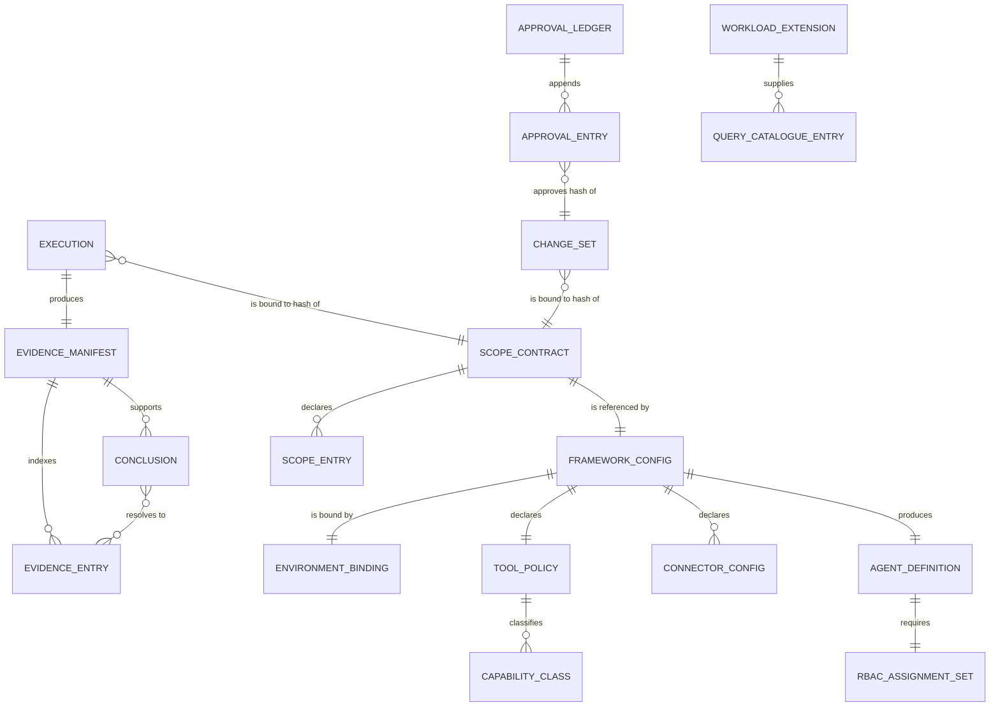

# Data Model

**Feature**: `sre-agent-recipe-framework`
**Date**: 2026-09-23
**Status**: Draft
**Traces to**: `spec.md` Key Entities, FR-02, FR-05, FR-24, FR-44 to FR-47
**Binds to**: [ADR-0004](../../architecture/decisions/0004-framework-tooling-runtime.md)

## Scope of This Document

This describes the **shape and relationships** of the contract entities. It is not the
schema. The schemas themselves are the Slice 3 deliverable and live at exactly one path,
`contracts/schemas/`, per FR-05.

Every entity below is runtime-agnostic (CON-03). Where a field has a runtime-specific
representation, the mapping lives in the binding layer and is named as such.

## Entity Relationships

## Entities

### Scope contract — Required, consumer-owned

The root declaration of what the agent may observe. Every downstream artifact binds to its
hash, so it is the anchor of the entire evidence chain.

| Field | Obligation | Notes |
|---|---|---|
| Schema version | Required | Explicit, per FR-05 |
| Subscription scope | Required | Single subscription in v1; the field is shaped so that widening to a list is additive |
| Scope entries | Required, non-empty | Each a selected resource or resource group with its type and identifier |
| Exclusions | Required, may be empty | Explicitly declared, never implied by omission |
| Observation period | Required | Start and end; an inverted period fails semantic validation (FR-28) |
| Execution limits | Required | Tool-call count, wall-clock duration, result-set size, per-query timeout |
| Generated at, generated against | Required | Point-in-time snapshot metadata, so selection-to-deployment drift is detectable |
| Canonical hash | Required | SHA-256 over the RFC 8785 canonical form with this field removed, per ADR-0004 |

Never committed to this framework with real values. The framework ships the schema and
placeholder examples only.

### Framework configuration — Required

Separates the eight concerns FR-24 enumerates. Each concern is a distinct, separately
addressable section, so that environment settings can vary while the workload definition
does not (FR-36).

Global defaults; environment settings; workload settings; tool and integration settings;
observability settings; remediation permissions; approval policies; external references for
sensitive values. No section may hold an inline secret — the schema does not permit a
property shaped like one (SEC-013).

### Tool policy — Required

Deny-by-default, deny-wins, fail-closed. Declares allowed capability classes, explicit deny
rules for the seven prohibited categories in FR-52, and the four execution limits.

**Capability classes, not runtime identifiers.** This indirection is what contains the open
item on unconfirmed runtime identifiers. The policy names classes; the binding layer maps
classes to the identifiers of a specific pinned runtime version; the mapping is marked
unverified until a reconciliation gate runs against that runtime. A capability the runtime
advertises and the policy does not classify fails the build rather than defaulting to
allowed (NEG-C).

### Agent definition — Required, binding-layer concrete form

Identity and metadata, target scope, access level, action mode, model provider, consumption
limit, tools and skills. The runtime-agnostic contract sits above it; `agent.json` is the
emitted concrete binding and appears only under `core/binding/` (ADR-0001, CON-03).

The tool list is never omitted. Omission causes the runtime to inherit global tools
including write tools, so an emitted binding without an explicit list is a defect and fails
NEG-D.

### RBAC assignment set — Required

The least-privilege read-scoped grants on the declared scopes, derived from the scope
contract rather than authored by hand.

This is the **authoritative** layer of the read-only guarantee. Verification is offline
against the compiled ARM: every role definition identifier must appear in a read-only
allow-list (NEG-A). Where the consumer supplies an existing identity, the principal's
existing assignments across the whole subscription are enumerated in preview and gate
post-deployment validation (SEC-003).

### Evidence manifest and evidence entry — Required

The manifest is bound to an execution identifier and to the scope-contract hash in force.

Each entry declares all five attributes, with no entry omitting any: provenance
classification, collection timestamp, freshness, data classification, content hash.

**An entry stores the hash of the content, never the content.** This is what makes the
injection and leakage mitigations structural rather than scan-based, and it is asserted by
NEG-F.

A source that could not be reached produces an entry in an explicit unobserved state. No
estimate, default or zero is ever substituted.

### Conclusion — Required

Every conclusion either resolves to one or more evidence entries, or carries an explicit
classification of derived, inferred or recommended. This is enforced as a per-execution
schema invariant at validation time, not by sampling.

### Change-set — Required as contract, not implemented in v1

Preconditions, blast radius, rollback plan, verification method, canonical hash, and the
hash of the scope contract it was produced under.

The schema exists. No execution path exists. Non-existence is asserted statically over
declared core paths (SEC-012, NEG-H), because exercising behaviour cannot prove absence.

### Approval ledger and approval entry — Required as contract, enforced by denial in v1

Append-only. Each entry references the hash of the artifact approved and records a decider.

The decider is compared against the agent's **managed identity principal object
identifier**, never a display name or configured label, so self-approval cannot be defeated
by renaming (SEC-016).

### Connector configuration — Required when any connector is used

Declared data-source connections. The declaration is committed; credentials are external
references only.

### Query catalogue entry — Recommended, framework ships defaults

A reviewed, integrity-verified diagnostic query. The **capability** is Required and ships
with defaults so that no authoring is needed for a first result (CON-11); the **queries**
are a workload extension point. Default and extension must stay separable, or SC-13 fails
as soon as a consumer customises.

Arbitrary query construction is denied by the tool policy.

### Workload extension — Optional per workload; the mechanism is Required

Consumer-supplied. Carries target resources, queries, alert definitions, connectors,
limits, network access mode, scheduling and report shaping. Lives entirely in
consumer-owned paths, so adding one never produces a diff inside the declared core.

### Handoff record — Recommended

Execution identity, idempotency key, turn and maximum turns, autonomy level defaulting to
read-only.

### Assessment result and readiness result — Recommended

Structured diagnostic outputs referencing evidence. Their status and confidence enumerations
carry English identifiers with the original reference values recorded as provenance
metadata (FR-03).

## Cross-Cutting Schema Rules

Applied to every schema without exception, and linted (NEG-I):

- `additionalProperties: false`, so unknown properties are rejected and the offending path
  is named (FR-27).
- An explicit schema version identifier (FR-05).
- No property name matching a secret-bearing pattern, and no free-form workload-payload
  field (SEC-013).
- Placeholders only in every shipped example.
- Authored within broadly supported 2020-12 features, per ADR-0004.

## Semantic Validation Beyond Structure

Structural conformance is necessary and insufficient. At minimum (FR-28):

- An empty in-scope selection fails.
- An observation period whose end precedes its start fails.
- A scope entry that no longer resolves fails at preview, before provisioning.
- A recomputed canonical hash that does not match the recorded one fails.

## References

- `docs/features/sre-agent-recipe-framework/spec.md` — Key Entities, FR-02 to FR-06,
  FR-23 to FR-30, FR-44 to FR-50
- `docs/architecture/minimum-sre-agent-contract.md`
- `docs/features/sre-agent-recipe-framework/security-review-architecture.md`
- [ADR-0004](../../architecture/decisions/0004-framework-tooling-runtime.md)
